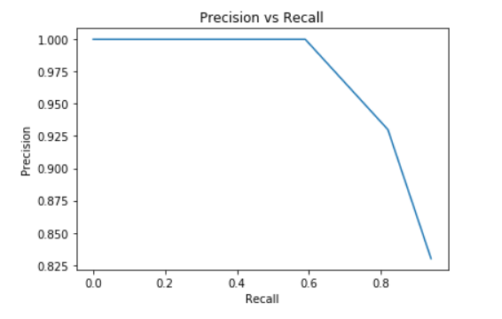

# INFO 624 Assignment 4

## 1. Student(s)

+ Manisha Nandawadekar, mun24@drexel.edu
+ Mahesh Sercat Ramakumar, ms4976@drexel.edu

## 2. Tasks and Steps

### 2.1 Data
In this assignment we are working on the same 20 research articles/papers data that are used in our assignments 2 and 3 and we reused some of the results from assignments 2 and 3.

### 2.2. Information Needs and Relevance Assessment
 For all three use cases that are used in assignment 3, we have created a table with the query keywords and their description of the what information we are expecting for that and checked every document in our data collection and assessed its relevance as 0 or 1 for each use case query and tabulated.

#### 2.2.1 Use Case 1: Narrow Query Assessment (1 point)
Below table contains all 20 documents details with an relevant? column to them which has marked with an value 1 for relevant and 0 for non-relevant based on use case1 query information needs.

| Narrow Query :  "fluid-attenuated inversion recovery"         |
|------------------------|

|Query Keywords| fluid, attenuated, inversion, recovery|
|----|----|
|Description of Information Need|"fluid-attenuated inversion recovery" is an MRI technique. Here we are using this query to retrieve all the relevant articles from the ms4976_info624_201904_articles index which have used this FLAIR MRI technique. We are expecting to return only one document which is written by Elizabeth M. Sweeney author where this author used Multimodal Structural MRI technique in there article to provide Comparison of Supervised Machine Learning Algorithms.|

|Doc ID|Author|Title|Relevant?|
|-------------|---------------|------------|-----------------|
|1|Upul Senanayake ,Mahendra Piraveenan and Albert Zomaya|The Pagerank-Index: Going beyond Citation Counts in Quantifying Scientific Impact of Researchers|0|
|2|Yajun Zhang ,Zongtian Liu and Wen Zhou|Event Recognition Based on Deep Learning in Chinese Texts|0|
|3|Zhan Ye ,Ahmad P. Tafti ,Karen Y. He ,Kai Wang and Max M. He|SparkText: Biomedical Text Mining on Big Data Framework|0|
|4|Xiurui Xie ,Hong Qu ,Guisong Liu ,Malu Zhang and Jürgen Kurths|An Efficient Supervised Training Algorithm for Multilayer Spiking Neural Networks|0|
|5|Wenjing Han ,Eduardo Coutinho ,Huabin Ruan ,Haifeng Li ,Björn Schuller and Xiaojie Yu,Xuan Zhu|Semi-Supervised Active Learning for Sound Classification in Hybrid Learning Environments|0|
|6|Amir H. Beiki ,Saba Saboor and Mansour Ebrahimi|A New Avenue for Classification and Prediction of Olive Cultivars Using Supervised and Unsupervised Algorithms|0|
|7|Elizabeth M. Sweeney ,Joshua T. Vogelstein ,Jennifer L. Cuzzocreo ,Peter A. Calabresi ,Daniel S. Reich ,Ciprian M. Crainiceanu and Russell T. Shinohara|A Comparison of Supervised Machine Learning Algorithms and Feature Vectors for MS Lesion Segmentation Using Multimodal Structural MRI|1|
|8|Diego Raphael Amancio ,Cesar Henrique Comin ,Dalcimar Casanova ,Gonzalo Travieso ,Odemir Martinez Bruno ,Francisco Aparecido Rodrigues and Luciano da Fontoura Costa|A Systematic Comparison of Supervised Classifiers|0|
|9|Shusen Zhou ,Qingcai Chen and Xiaolong Wang|Active Semi-Supervised Learning Method with Hybrid Deep Belief Networks|0|
|10|Brian Gardner and André Grüning|Supervised Learning in Spiking Neural Networks for Precise Temporal Encoding|0|
|11|Mohamad Hazim ,Nor Badrul Anuar ,Mohd Faizal Ab Razak and Nor Aniza Abdullah|Detecting opinion spams through supervised boosting approach|0|
|12|Xiang Zhang,Naiyang Guan ,Zhilong Jia,Xiaogang Qiu and Zhigang Luo|Semi-Supervised Projective Non-Negative Matrix Factorization for Cancer Classification|0|
|13|Jianjun Cheng ,Mingwei Leng,Longjie Li,Hanhai Zhou and Xiaoyun Chen|Active Semi-Supervised Community Detection Based on Must-Link and Cannot-Link Constraints|0|
|14|Zhuoran Wang,Anoop D. Shah ,A. Rosemary Tate,Spiros Denaxas,John Shawe-Taylor and Harry Hemingway|Extracting Diagnoses and Investigation Results from Unstructured Text in Electronic Health Records by Semi-Supervised Machine Learning|0|
|15|Hjalmar K. Turesson ,Sidarta Ribeiro,Danillo R. Pereira,João P. Papa and Victor Hugo C. de Albuquerque|Machine Learning Algorithms for Automatic Classification of Marmoset Vocalizations|0|
|16|Ao Li ,Deyun Chen,Zhiqiang Wu,Guanglu Sun and Kezheng Lin|Self-supervised sparse coding scheme for image classification based on low rank representation|0|
|17|Andrius Vabalas ,Emma Gowen,Ellen Poliakoff and Alexander J. Casson|Machine learning algorithm validation with a limited sample size|0|
|18|Ranjan Kumar Barman,Sudipto Saha and Santasabuj Das|Prediction of Interactions between Viral and Host Proteins Using Supervised Machine Learning Methods|0|
|19|Hailin Chen and Zuping Zhang|A Semi-Supervised Method for Drug-Target Interaction Prediction with Consistency in Networks|0|
|20|Anca Ciurte ,Xavier Bresson,Olivier Cuisenaire,Nawal Houhou,Sergiu Nedevschi,Jean-Philippe Thiran and Meritxell Bach Cuadra|Semi-Supervised Segmentation of Ultrasound Images Based on Patch Representation and Continuous Min Cut|0|


#### 2.2.2 Use Case 2: Broad Query Assessment (1 point)
Below table contains all 20 documents details with an relevant? column to them which has marked with an value 1 for relevant and 0 for non-relevant based on use case 2 query information needs.

|  Broad Query :  "Machine Learning Algorithms"         |
|------------------------|

|Query Keywords| Machine, Learning, Algorithms|
|----|----|
|Description of Information Need| We are using this query to retrieve all the relevant documents/articles from the ms4976_info624_201904_articles index which have used/applied/described machine learning algorithms. In this case which should return all documents/articles from the index except few articles as mostly our data in the index are related to  Machine learning algorithms and very few belongs to deep learning and others.|

|Doc ID|Author|Title|Relevant?|
|-------------|---------------|------------|-----------------|
|1|Upul Senanayake ,Mahendra Piraveenan and Albert Zomaya|The Pagerank-Index: Going beyond Citation Counts in Quantifying Scientific Impact of Researchers|0|
|2|Yajun Zhang ,Zongtian Liu and Wen Zhou|Event Recognition Based on Deep Learning in Chinese Texts|0|
|3|Zhan Ye ,Ahmad P. Tafti ,Karen Y. He ,Kai Wang and Max M. He|SparkText: Biomedical Text Mining on Big Data Framework|0|
|4|Xiurui Xie ,Hong Qu ,Guisong Liu ,Malu Zhang and Jürgen Kurths|An Efficient Supervised Training Algorithm for Multilayer Spiking Neural Networks|1|
|5|Wenjing Han ,Eduardo Coutinho ,Huabin Ruan ,Haifeng Li ,Björn Schuller and Xiaojie Yu,Xuan Zhu|Semi-Supervised Active Learning for Sound Classification in Hybrid Learning Environments|1|
|6|Amir H. Beiki ,Saba Saboor and Mansour Ebrahimi|A New Avenue for Classification and Prediction of Olive Cultivars Using Supervised and Unsupervised Algorithms|1|
|7|Elizabeth M. Sweeney ,Joshua T. Vogelstein ,Jennifer L. Cuzzocreo ,Peter A. Calabresi ,Daniel S. Reich ,Ciprian M. Crainiceanu and Russell T. Shinohara|A Comparison of Supervised Machine Learning Algorithms and Feature Vectors for MS Lesion Segmentation Using Multimodal Structural MRI|1|
|8|Diego Raphael Amancio ,Cesar Henrique Comin ,Dalcimar Casanova ,Gonzalo Travieso ,Odemir Martinez Bruno ,Francisco Aparecido Rodrigues and Luciano da Fontoura Costa|A Systematic Comparison of Supervised Classifiers|1|
|9|Shusen Zhou ,Qingcai Chen and Xiaolong Wang|Active Semi-Supervised Learning Method with Hybrid Deep Belief Networks|1|
|10|Brian Gardner and André Grüning|Supervised Learning in Spiking Neural Networks for Precise Temporal Encoding|1|
|11|Mohamad Hazim ,Nor Badrul Anuar ,Mohd Faizal Ab Razak and Nor Aniza Abdullah|Detecting opinion spams through supervised boosting approach|1|
|12|Xiang Zhang,Naiyang Guan ,Zhilong Jia,Xiaogang Qiu and Zhigang Luo|Semi-Supervised Projective Non-Negative Matrix Factorization for Cancer Classification|1|
|13|Jianjun Cheng ,Mingwei Leng,Longjie Li,Hanhai Zhou and Xiaoyun Chen|Active Semi-Supervised Community Detection Based on Must-Link and Cannot-Link Constraints|1|
|14|Zhuoran Wang,Anoop D. Shah ,A. Rosemary Tate,Spiros Denaxas,John Shawe-Taylor and Harry Hemingway|Extracting Diagnoses and Investigation Results from Unstructured Text in Electronic Health Records by Semi-Supervised Machine Learning|1|
|15|Hjalmar K. Turesson ,Sidarta Ribeiro,Danillo R. Pereira,João P. Papa and Victor Hugo C. de Albuquerque|Machine Learning Algorithms for Automatic Classification of Marmoset Vocalizations|1|
|16|Ao Li ,Deyun Chen,Zhiqiang Wu,Guanglu Sun and Kezheng Lin|Self-supervised sparse coding scheme for image classification based on low rank representation|1|
|17|Andrius Vabalas ,Emma Gowen,Ellen Poliakoff and Alexander J. Casson|Machine learning algorithm validation with a limited sample size|1|
|18|Ranjan Kumar Barman,Sudipto Saha and Santasabuj Das|Prediction of Interactions between Viral and Host Proteins Using Supervised Machine Learning Methods|1|
|19|Hailin Chen and Zuping Zhang|A Semi-Supervised Method for Drug-Target Interaction Prediction with Consistency in Networks|1|
|20|Anca Ciurte ,Xavier Bresson,Olivier Cuisenaire,Nawal Houhou,Sergiu Nedevschi,Jean-Philippe Thiran and Meritxell Bach Cuadra|Semi-Supervised Segmentation of Ultrasound Images Based on Patch Representation and Continuous Min Cut|1|


#### 2.2.3 Use Case 3: Author plus Broad Keywords Assessment (1 point)
Below table contains all 20 documents details with an relevant? column to them which has marked with an value 1 for relevant and 0 for non-relevant based on use case 3 query information needs.


| Author plus Broad Keywords :   "Saba Saboor Machine Learning Algorithms"        |
|------------------------|

|Query Keywords| "Saba", "Saboor", "Machine", "Learning", "Algorithms"|
|----|----|
|Description of Information Need|"Saba Saboor Machine Learning Algorithms" keyword is an author plus keywords, Here we are using this query to retrieve all the relevant documents from the ms4976_info624_201904_articles index which are written by Saba Saboor and used/applied machine learning algorithms in them. In this case the number of document relevant are more than 16 in my index as many documents contains this board keywords and few books were written by author Saba Saboor|

|Doc ID|Author|Title|Relevant?|
|-------------|---------------|------------|-----------------|
|1|Upul Senanayake ,Mahendra Piraveenan and Albert Zomaya|The Pagerank-Index: Going beyond Citation Counts in Quantifying Scientific Impact of Researchers|0|
|2|Yajun Zhang ,Zongtian Liu and Wen Zhou|Event Recognition Based on Deep Learning in Chinese Texts|0|
|3|Zhan Ye ,Ahmad P. Tafti ,Karen Y. He ,Kai Wang and Max M. He|SparkText: Biomedical Text Mining on Big Data Framework|0|
|4|Xiurui Xie ,Hong Qu ,Guisong Liu ,Malu Zhang and Jürgen Kurths|An Efficient Supervised Training Algorithm for Multilayer Spiking Neural Networks|0|
|5|Wenjing Han ,Eduardo Coutinho ,Huabin Ruan ,Haifeng Li ,Björn Schuller and Xiaojie Yu,Xuan Zhu|Semi-Supervised Active Learning for Sound Classification in Hybrid Learning Environments|0|
|6|Amir H. Beiki ,Saba Saboor and Mansour Ebrahimi|A New Avenue for Classification and Prediction of Olive Cultivars Using Supervised and Unsupervised Algorithms|1|
|7|Elizabeth M. Sweeney ,Joshua T. Vogelstein ,Jennifer L. Cuzzocreo ,Peter A. Calabresi ,Daniel S. Reich ,Ciprian M. Crainiceanu and Russell T. Shinohara|A Comparison of Supervised Machine Learning Algorithms and Feature Vectors for MS Lesion Segmentation Using Multimodal Structural MRI|0|
|8|Diego Raphael Amancio ,Cesar Henrique Comin ,Dalcimar Casanova ,Gonzalo Travieso ,Odemir Martinez Bruno ,Francisco Aparecido Rodrigues and Luciano da Fontoura Costa|A Systematic Comparison of Supervised Classifiers|0|
|9|Shusen Zhou ,Qingcai Chen and Xiaolong Wang|Active Semi-Supervised Learning Method with Hybrid Deep Belief Networks|0|
|10|Brian Gardner and André Grüning|Supervised Learning in Spiking Neural Networks for Precise Temporal Encoding|0|
|11|Mohamad Hazim ,Nor Badrul Anuar ,Mohd Faizal Ab Razak and Nor Aniza Abdullah|Detecting opinion spams through supervised boosting approach|0|
|12|Xiang Zhang,Naiyang Guan ,Zhilong Jia,Xiaogang Qiu and Zhigang Luo|Semi-Supervised Projective Non-Negative Matrix Factorization for Cancer Classification|0|
|13|Jianjun Cheng ,Mingwei Leng,Longjie Li,Hanhai Zhou and Xiaoyun Chen|Active Semi-Supervised Community Detection Based on Must-Link and Cannot-Link Constraints|0|
|14|Zhuoran Wang,Anoop D. Shah ,A. Rosemary Tate,Spiros Denaxas,John Shawe-Taylor and Harry Hemingway|Extracting Diagnoses and Investigation Results from Unstructured Text in Electronic Health Records by Semi-Supervised Machine Learning|0|
|15|Hjalmar K. Turesson ,Sidarta Ribeiro,Danillo R. Pereira,João P. Papa and Victor Hugo C. de Albuquerque|Machine Learning Algorithms for Automatic Classification of Marmoset Vocalizations|0|
|16|Ao Li ,Deyun Chen,Zhiqiang Wu,Guanglu Sun and Kezheng Lin|Self-supervised sparse coding scheme for image classification based on low rank representation|0|
|17|Andrius Vabalas ,Emma Gowen,Ellen Poliakoff and Alexander J. Casson|Machine learning algorithm validation with a limited sample size|0|
|18|Ranjan Kumar Barman,Sudipto Saha and Santasabuj Das|Prediction of Interactions between Viral and Host Proteins Using Supervised Machine Learning Methods|0|
|19|Hailin Chen and Zuping Zhang|A Semi-Supervised Method for Drug-Target Interaction Prediction with Consistency in Networks|0|
|20|Anca Ciurte ,Xavier Bresson,Olivier Cuisenaire,Nawal Houhou,Sergiu Nedevschi,Jean-Philippe Thiran and Meritxell Bach Cuadra|Semi-Supervised Segmentation of Ultrasound Images Based on Patch Representation and Continuous Min Cut|0|


## 3. Search Result Evaluation

### 3.1 Use Case 1: Basic Evaluation (1 point)
Below table contains the top three hits for use case 1 narrow query(fluid-attenuated inversion recovery). We copied this table from Table 1 in Assignment 3.

For this narrow query we are getting only two results retrieved as the keywords are soo rare in our index

| Doc ID | Author             | Title                                 | Score |
|--------|--------------------|---------------------------------------|-------|
|    7   |  "Elizabeth M. Sweeney ,Joshua T. Vogelstein ,Jennifer L. Cuzzocreo ,Peter A. Calabresi ,Daniel S. Reich ,Ciprian M. Crainiceanu and Russell T. Shinohara"|"A Comparison of Supervised Machine Learning Algorithms and Feature Vectors for MS Lesion Segmentation Using Multimodal Structural MRI" |  9.350587  |
|    20  |"Anca Ciurte ,Xavier Bresson,Olivier Cuisenaire,Nawal Houhou,Sergiu Nedevschi,Jean-Philippe Thiran and Meritxell Bach Cuadra" | "Semi-Supervised Segmentation of Ultrasound Images Based on Patch Representation and Continuous Min Cut" |   2.0065608 |

Based on the above table and relevance assessment for use case 1, we have constructed a confusion matrix to find the values for TP, FP, FN, and TN.

**Relevant:** Doc 7

**Non-Relevant:** Doc 1, Doc 2, Doc 3, Doc 4, Doc 5, Doc 6, Doc 8, Doc 9, Doc 10, Doc 11, Doc 12, Doc 13, Doc 14, Doc 15, Doc 16, Doc 17, Doc 18, Doc 19, Doc 20

**Retrieved:** Doc 7, Doc 20

**Not Retrieved:** Doc 1, Doc 2, Doc 3, Doc 4, Doc 5, Doc 6, Doc 8, Doc 9, Doc 10, Doc 11, Doc 12, Doc 13, Doc 14, Doc 15, Doc 16, Doc 17, Doc 18, Doc 19


|     |Relevant|Non-Relevant|
|-----|--------|------------|
|Retrieved|TP = 1(Doc 7)  |FP = 1(Doc 20)|
|Not-Retrieved|FN =0 |TN=18|


Precision, Recall, and F1 scores are calculated below:

**Precision (P)	=** TP / (TP + FP)

		= 1 / (1 + 1)
		= 1 / 2
		= 0.5

**Recall (R)	=** TP / (TP + FN)

		= 1 / (1 + 0)
		= 1/1
		= 1

**F-1 score	=** 2PR / (P + R)

		= 2 * 0.5 * 1 / (0.5 + 1)
		= 1 / 1.5
		= 0.66

### 3.2 Use Case 2: Precision and Recall Curve (2 points)

**Broad search query (use case 2) to retrieve top 5 documents :**

Below query will retrieve the top five hits for use case 2 broad query(Machine Learning Algorithms).

```json
GET ms4976_info624_201904_articles/_search
{
  "from" : 0, "size" : 5,
  "query": {
    "multi_match" : {
      "query": "Machine Learning Algorithms",
      "fields": [ "author", "title", "abstract" ]
    }
  }
}
```
Note: To make this document more readable, We have not included the response result for the above query. We got Doc 7, Doc 9, Doc 14, Doc 15 and Doc 17 as top 5 retrieved results

Based on the above query response results and relevance assessment for use case 2, we have constructed a confusion matrix to find the values for TP, FP, FN, and TN.

**Relevant:** Doc 4, Doc 5, Doc 6, Doc 7, Doc 8, Doc 9, Doc 10, Doc 11, Doc 12, Doc 13, Doc 14, Doc 15, Doc 16, Doc 17, Doc 18, Doc 19, Doc 20

**Non-Relevant:** Doc 1, Doc 2, Doc 3

**Retrieved:** Doc 7, Doc 9, Doc 14, Doc 15, Doc 17

**Not Retrieved:** Doc 1, Doc 2, Doc 3, Doc 4, Doc 5, Doc 6, Doc 8, Doc 10, Doc 11, Doc 12, Doc 13, Doc 16, Doc 18, Doc 19, Doc 20


|     |Relevant|Non-Relevant|
|-----|--------|------------|
|**Retrieved**|TP = 5 (Doc 7,  Doc 9, Doc 14, Doc 15, Doc 17)  |FP = 0|
|**Not-Retrieved**|FN =12 (Doc 4, Doc 5, Doc 6, Doc 8, Doc 10, Doc 11, Doc 12, Doc 13, Doc 16, Doc 18, Doc 19, Doc 20) |TN=3 (Doc 1, Doc 2, Doc 3)|

Precision, Recall, and F1 scores are calculated below:

**Precision (P) =** TP / (TP + FP)

		= 5 / (5 + 0)
		= 5 / 5
		= 1

**Recall (R) =** TP / (TP + FN)

		= 5 / (5 + 12)
		= 5/17
		= 0.29

**F-1 score	=** 2PR / (P + R)

		= 2 * 1 * 0.29 / (1 + 0.29)
		= 0.58 / 1.29
		= 0.449


**Broad search query (use case 2) to retrieve top 10 documents :**

Below query will retrieve the top ten hits for use case 2 broad query(Machine Learning Algorithms).

```json
GET ms4976_info624_201904_articles/_search
{
  "from" : 0, "size" : 10,
  "query": {
    "multi_match" : {
      "query": "Machine Learning Algorithms",
      "fields": [ "author", "title", "abstract" ]
    }
  }
}
```
Note: To make this document more readable, We have not included the response result for the above query. We got Doc 4, Doc 5, Doc 6, Doc 7, Doc 8, Doc 9, Doc 14, Doc 15, Doc 17, Doc 18 as top 10 retrieved results

Based on the above query response results and relevance assessment for use case 2, we have constructed a confusion matrix to find the values for TP, FP, FN, and TN.

**Relevant:**  Doc 4, Doc 5, Doc 6, Doc 7, Doc 8, Doc 9, Doc 10, Doc 11, Doc 12, Doc 13, Doc 14, Doc 15, Doc 16, Doc 17, Doc 18, Doc 19, Doc 20

**Non-Relevant:** Doc 1, Doc 2, Doc 3

**Retrieved:** Doc 4, Doc 5, Doc 6, Doc 7, Doc 8, Doc 9, Doc 14, Doc 15, Doc 17, Doc 18

**Not Retrieved:** Doc 1, Doc 2, Doc 3, Doc 10, Doc 11, Doc 12, Doc 13, Doc 16, Doc 19, Doc 20


|     |Relevant|Non-Relevant|
|-----|--------|------------|
|Retrieved|TP = 10 (Doc 4, Doc 5, Doc 6, Doc 7, Doc 8, Doc 9, Doc 14, Doc 15, Doc 17, Doc 18)  |FP = 0|
|Not-Retrieved|FN =7 (Doc 10, Doc 11, Doc 12, Doc 13, Doc 16, Doc 19, Doc 20) |TN=3 (Doc 1, Doc 2, Doc 3)|


Precision, Recall, and F1 scores are calculated below:

**Precision (P) =** TP / (TP + FP)
		= 10 / (10 + 0)
		= 10 / 10
		= 1

**Recall (R) =** TP / (TP + FN)
		= 10 / (10 + 7)
		= 10/17
		= 0.59

**F-1 score =** 2PR / (P + R)

		= 2 * 1 * 0.59 / (1 + 0.59)
		= 1.18 / 1.59
		= 0.74


**Broad search query (use case 2) to retrieve top 15 documents:**

Below query will retrieve the top fifteen hits for use case 2 broad query(Machine Learning Algorithms).

```json
GET ms4976_info624_201904_articles/_search
{
  "from" : 0, "size" : 15,
  "query": {
    "multi_match" : {
      "query": "Machine Learning Algorithms",
      "fields": [ "author", "title", "abstract" ]
    }
  }
}
```
Note: To make this document more readable, We have not included the response result for the above query. We got Doc 2, Doc 4, Doc 5, Doc 6, Doc 7, Doc 8, Doc 9, Doc 10 Doc 12, Doc 13, Doc 14, Doc 15, Doc 17, Doc 18, Doc 20 as top 15 retrieved results

Based on the above query response results and relevance assessment for use case 2, we have constructed a confusion matrix to find the values for TP, FP, FN, and TN.

**Relevant:**  Doc 4, Doc 5, Doc 6, Doc 7, Doc 8, Doc 9, Doc 10, Doc 11, Doc 12, Doc 13, Doc 14, Doc 15, Doc 16, Doc 17, Doc 18, Doc 19, Doc 20

**Non-Relevant:** Doc 1, Doc 2, Doc 3

**Retrieved:** Doc 2, Doc 4, Doc 5, Doc 6, Doc 7, Doc 8, Doc 9, Doc 10 Doc 12, Doc 13, Doc 14, Doc 15, Doc 17, Doc 18, Doc 20

**Not Retrieved:** Doc 1, Doc 3, Doc 11, Doc 16, Doc 19


|     |Relevant|Non-Relevant|
|-----|--------|------------|
|Retrieved|TP = 14 ( Doc 4, Doc 5, Doc 6, Doc 7, Doc 8, Doc 9, Doc 10 Doc 12, Doc 13, Doc 14, Doc 15, Doc 17, Doc 18, Doc 20)  |FP = 1 (Doc 2)|
|Not-Retrieved|FN =3 (Doc 11, Doc 16, Doc 19) |TN=2 (Doc 1, Doc 3)|


Precision, Recall, and F1 scores are calculated below:

**Precision (P) =** TP / (TP + FP)

    		= 14 / (14 + 1)
    		= 14 / 15
    		= 0.93

**Recall (R) =** TP / (TP + FN)

    		= 14 / (14 + 3)
    		= 14/17
    		= 0.82

**F-1 score =** 2PR / (P + R)

    		= 2 * 0.93 * 0.82 / (0.93 + 0.82)
    		= 1.52 / 1.75
    		= 0.868


**Broad search query (use case 2) to retrieve top 20 documents:**

Below query will retrieve the top 20 hits(all) for use case 2 broad query(Machine Learning Algorithms).

```json
GET ms4976_info624_201904_articles/_search
{
  "from" : 0, "size" : 20,
  "query": {
    "multi_match" : {
      "query": "Machine Learning Algorithms",
      "fields": [ "author", "title", "abstract" ]
    }
  }
}
```

Note: To make this document more readable, We have not included the response result for the above query. We got Doc 1, Doc 2, Doc 4, Doc 5, Doc 6, Doc 7, Doc 8, Doc 9, Doc 10, Doc 12, Doc 13, Doc 14, Doc 15, Doc 16, Doc 17, Doc 18, Doc 19, Doc 20 as top 18 retrieved results


Based on the above query response results and relevance assessment for use case 2, we have constructed a confusion matrix to find the values for TP, FP, FN, and TN.

**Relevant:**  Doc 4, Doc 5, Doc 6, Doc 7, Doc 8, Doc 9, Doc 10, Doc 11, Doc 12, Doc 13, Doc 14, Doc 15, Doc 16, Doc 17, Doc 18, Doc 19, Doc 20

**Non-Relevant:** Doc 1, Doc 2, Doc 3

**Retrieved:** Doc 1, Doc 2, Doc 4, Doc 5, Doc 6, Doc 7, Doc 8, Doc 9, Doc 10, Doc 12, Doc 13, Doc 14, Doc 15, Doc 16, Doc 17, Doc 18, Doc 19, Doc 20

**Not Retrieved:**  Doc 3, Doc 11


|     |Relevant|Non-Relevant|
|-----|--------|------------|
|Retrieved|TP = 16 ( Doc 4, Doc 5, Doc 6, Doc 7, Doc 8, Doc 9, Doc 10, Doc 12, Doc 13, Doc 14, Doc 15, Doc 16, Doc 17, Doc 18, Doc 19, Doc 20)  |FP = 2 (Doc 1, Doc 2)|
|Not-Retrieved|FN =1 (Doc 11) |TN=1 (Doc 3)|


Precision, Recall, and F1 scores are calculated below:

**Precision (P) =** TP / (TP + FP)

            		= 16 / (16 + 2)
            		= 16 / 18
            		= 0.89

**Recall (R) =** TP / (TP + FN)

            = 16 / (16 + 1)
            = 16/17
            = 0.94

**F-1 score	=** 2PR / (P + R)

          = 2 * 0.89 * 0.94 / (0.89 + 0.94)
          = 1.67 / 1.83
          = 0.914

|Top # Hits| Precision| Recall|
|----|----|-----|
|0 |1.0| 0.0|
|5|1.0|0.29|
|10|1.0|0.59|
|15|0.93|0.82|
|20|0.89|0.94|


Below is the Precision vs recall curve for our broad query(use case 2):



#Same image has been attached to the submission. Please see the attached image if you face any issues in viewing the above image.

**Comparision of Precision-Recall Curve**

* Both the Precison-Recall curves recall values are increasing with respect to number of the hits increases as recall is directly proportional to the number of the hits.

* In instructor graph, we can see that curve falls gradually with increase in number of documents retrieved whereas in our graph the line is constant till recall value reach's around 0.6 and than it start decreasing.

* In our case, Precision values are same for top5 and top10 hits because we used the board query which has 17 out of 20 articles in the index are relevant to it and due to this there is a very less chance that our elastic search engine to return false positive values for small number of hit values. The results for 5 and 10 hits has zero false positive(fp)

* By seeing the results of Precision-Recall curves for only on this board query is not effective way to measure the performance of the system we need to should consider many query to evaluate.

* We can observe that when all documents are retrieved we are getting good recall and precision values than instructor curve

* Overall we can say that our precision-recall curve gives better performance for this board query.

### 3.3 Use Case 3: Rank Evaluation and Comparison (2 points)

```json
GET ms4976_info624_201904_articles/_search
{
  "from" : 0, "size" : 3,
  "query": {
    "multi_match" : {
      "query": "Saba Saboor Machine Learning Algorithms",
      "fields": [ "author", "title", "abstract" ]
    }
  }
}
```

|Doc ID|Author|Title|Relevant?|
|-------------|---------------|------------|-----------------|
|6|Amir H. Beiki ,Saba Saboor and Mansour Ebrahimi|A New Avenue for Classification and Prediction of Olive Cultivars Using Supervised and Unsupervised Algorithms|1|
|15|Hjalmar K. Turesson ,Sidarta Ribeiro,Danillo R. Pereira,João P. Papa and Victor Hugo C. de Albuquerque|Machine Learning Algorithms for Automatic Classification of Marmoset Vocalizations|0|
|17|Andrius Vabalas ,Emma Gowen,Ellen Poliakoff and Alexander J. Casson|Machine learning algorithm validation with a limited sample size|0|

Computed DCG (Discounted Cumulative Gain) based on the above table. The following are the steps which are involved in the computation.

**DCG3 =** rel1 + rel2 / log(2) + rel3 / log(3)

      = rel1 + rel2 / 1 + rel3 / 1.5849
      = 1 + 0 / 1 + 0 / 1.5849
      = 1 + 0 + 0
      = 1

Again we Conducted the same search query with a boosted author field (authorˆ3) and listed the top three hits in following table.

```json
GET ms4976_info624_201904_articles/_search
{
  "from" : 0, "size" : 3,
  "query": {
    "multi_match" : {
      "query": "Saba Saboor Machine Learning Algorithms",
      "fields": [ "author^3", "title", "abstract" ]
    }
  }
}
```

|Doc ID|Author|Title|Relevant?|
|-------------|---------------|------------|-----------------|
|6|Amir H. Beiki ,Saba Saboor and Mansour Ebrahimi|A New Avenue for Classification and Prediction of Olive Cultivars Using Supervised and Unsupervised Algorithms|1|
|15|Hjalmar K. Turesson ,Sidarta Ribeiro,Danillo R. Pereira,João P. Papa and Victor Hugo C. de Albuquerque|Machine Learning Algorithms for Automatic Classification of Marmoset Vocalizations|0|
|17|Andrius Vabalas ,Emma Gowen,Ellen Poliakoff and Alexander J. Casson|Machine learning algorithm validation with a limited sample size|0|

Computed DCG (Discounted Cumulative Gain) based on the above table. The following are the steps which are involved in the computation.

**DCG3 =** rel1 + rel2 / log(2) + rel3 / log(3)

      = rel1 + rel2 / 1 + rel3 / 1.5849
      = 1 + 0 / 1 + 0 / 1.5849
      = 1 + 0 + 0
      = 1

Compare the two DCG scores. Which query produced a better ranked result, with or
without a boosted author field?

* Discounted Cumulative Gain(DCG) scores for both use case 3 and boosted author field in use case 3 are having same results with a value of 1.

* The reason for this is only one article in the index is relevant to this use case 3 query and also when you apply boosting to author field and the query contains the author name has only one document in our index which will impact in increasing score of that document itself which is already in the top  of the list. So the retrieval order is preserved in our case which makes no difference in both results in terms of order.

* As in both cases, only one document is relevant to the given query and also it is in top retrieval one, So the DCG components of rel2 ,rel3 soo on are equal to zero which will always return 1.

* Both performed well and there is no difference in results as ranking of DCG is based on Relevance of articles retrieved w.r.to there positions.
